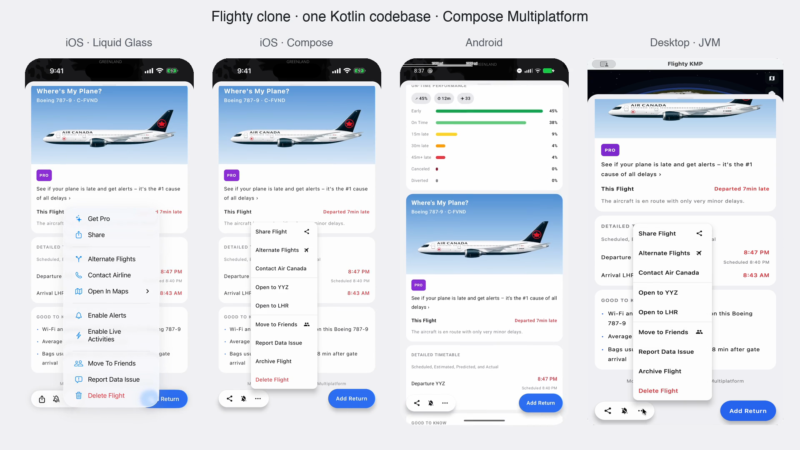

# Flighty KMP

A [Flighty](https://flighty.com)-style flight tracker built with **Compose Multiplatform**, targeting
**Android**, **iOS**, and **desktop (JVM)** from a single codebase. All data is mocked — a frozen
snapshot of "Mon, Jul 20" with one flight mid-air.

Inspired by [this demo](https://x.com/nater02/status/2079180521427308791) of Flighty rebuilt with
Expo — this is the Kotlin Multiplatform take on the same idea, styled after the real app: a dark
earth-from-space map backdrop with a light sheet floating over it.

## Demo

All four apps — the Liquid Glass iOS app (native SwiftUI chrome), the full-Compose iOS app,
Android, and desktop — running the same scripted walkthrough side by side:

https://github.com/luca992/flighty-cmp/raw/main/demo-captures/composite.mp4

[](demo-captures/composite.mp4)

Per-platform captures live in [`demo-captures/`](demo-captures), and the scripts that
recorded them (adb / idb / Quartz automation) in [`capture-scripts/`](capture-scripts).

## What's in the app

- **Space-map backdrop** (every screen) — star field, glowing planet horizon, city lights, and the
  selected flight's route arc projected from the airports' real lat/lon, with airport chips and a
  plane marker at the flight's live progress. Drawn entirely with a common-code `Canvas`.
- **My Flights** — Upcoming/Past toggle, day-grouped cards with airline badge, big colored times
  (green = on time, red = late, struck-through original schedule on delays), yellow gate chips,
  and a live progress bar for the in-air flight.
- **Flight detail** — Flighty-style sheet: header with airline + flight number + close button,
  "Landing in 1h 58m" headline, departure/arrival blocks with huge colored times, gate/terminal/
  baggage, aircraft/duration/distance divider line, booking-code & seat tiles, share button.
- **Friends** — friends' flights with live statuses.
- **Passport** — indigo "All-Time Flighty Passport" gradient card (flights, distance, flight time,
  airports, airlines) and a red monthly share card.

## Architecture

Two-layer KMP with unidirectional data flow, all in common source sets. The
platform modules are 3-line entry stubs.

```
core/                    kmp/lib — Compose-free domain layer
  src/flighty/
    model/               Domain types (Flight, Airport, Airline, Friend, …)
    data/                FlightRepository interface + MockFlightRepository + dataset;
                         AppGraph is the (deliberately tiny) composition root
    vm/                  One ViewModel per screen exposing a single immutable
                         UiState via StateFlow; events are plain functions
  test/                  Mock-data invariants + ViewModel unit tests
shared/                  kmp/lib — Compose UI, depends on core
  src/flighty/
    Nav.kt               Navigation 3 back-stack keys
    App.kt               Root: backdrop + sheet + NavDisplay + tab bar;
                         ViewModels created at nav-entry level
    ui/                  Screens (state down, events up — they never see a
                         ViewModel), theme, components
android-app/             android/app — MainActivity calling App()
ios-app/                 ios/app — ComposeUIViewController + SwiftUI host (Xcode project included)
jvm-app/                 jvm/app — desktop window, handy for quick iteration
```

Rules of the shape: UI depends on `core`, never the reverse; `core` has no
Compose dependency; ViewModels depend on `FlightRepository` (the interface), so
a real backend replaces `MockFlightRepository` without touching presentation;
navigation is a Navigation 3 back stack (`NavDisplay` + `entryProvider`).

Cross-platform behavior parity: system back on Android pops the detail sheet via the new
`NavigationBackHandler` (the non-deprecated replacement for `BackHandler`), matching the X button;
safe-area insets handled with `statusBarsPadding`/`navigationBarsPadding`; no emoji glyphs (vector
icons only) so rendering is identical on all platforms.

## Toolchain

Set up and built entirely with the new **[Kotlin Toolchain](https://kotlin-toolchain.org)**
(v0.11.1, the evolution of Amper announced at KotlinConf'26) — no Gradle project files. Modules
are declared in `module.yaml`; the `./kotlin` wrapper provisions everything (JRE, Android SDK,
Kotlin/Native, xcodebuild glue).

```sh
./kotlin build                                       # build all platforms
./kotlin test -p jvm                                 # run tests
./kotlin run --module jvm-app                        # desktop app
./kotlin run --module android-app                    # Android emulator/device
./kotlin run --module ios-app \
  --platform=iosSimulatorArm64 --device-id=<UDID>    # iOS simulator
```

You can also open `ios-app/module.xcodeproj` in Xcode.

### Versions

| Thing | Version | Note |
| --- | --- | --- |
| Kotlin Toolchain (build tool) | 0.11.1 | latest release |
| Kotlin compiler | 2.4.0 | pinned via `settings.kotlin.version` (latest stable) |
| Compose Multiplatform | 1.11.1 | pinned via `settings.compose.version` (latest) |
| navigationevent-compose | 1.0.1 | new predictive-back API |
| androidx.activity:activity-compose | 1.13.0 | latest |
| MapLibre Compose / MapLibre Native iOS | 0.13.0 / 6.25.1 | see "Maps" below |

Notes:
- Compose 1.11 dropped the Intel iOS simulator (`iosX64`), so targets are `iosArm64` +
  `iosSimulatorArm64`.
- The generated Xcode project needed `IPHONEOS_DEPLOYMENT_TARGET = 16.0` — without it, Xcode 26
  defaults the minimum OS to the SDK version and finds no iOS 18.x simulator destinations.

## Maps: real MapLibre + a drawn globe

Two backdrops, matching the real Flighty:

- **Flight detail** (Android + iOS): a real
  [MapLibre Compose](https://maplibre.org/maplibre-compose/) vector map
  (`org.maplibre.compose:maplibre-compose:0.13.0`, OpenFreeMap `dark` style, no API key) with the
  great-circle route, endpoints, and plane position as GeoJSON layers.
- **Tabs & desktop**: an orthographic **globe** drawn in commonMain — real Natural Earth
  coastlines projected onto a sphere with atmosphere glow, graticule, city lights, and the live
  route arcing over it. (MapLibre Compose's desktop backend is ~15% complete, hence the fallback;
  mobile MapLibre has no globe projection yet, hence the canvas globe for the hero screens.)

### How MapLibre works here without Gradle (the interesting part)

MapLibre Compose on iOS normally requires the Kotlin CocoaPods/SPM **Gradle** plugins to link the
native `MapLibre.framework` — which the Kotlin Toolchain doesn't support yet. This project wires
it manually:

1. `scripts/fetch-maplibre-ios.sh` downloads the official `MapLibre.dynamic.xcframework` (6.25.1)
   into `ios-app/Frameworks/` (gitignored) and rewrites the absolute `-F` linker paths in the
   module.yaml files to your checkout's location — run it once after cloning (and again if the
   checkout moves).
2. `shared/module.yaml` and `ios-app/module.yaml` pass `-linker-option -F<slice> -framework
   MapLibre` to the Kotlin/Native link via `settings@iosArm64` / `settings@iosSimulatorArm64`
   `freeCompilerArgs` (absolute paths required — relative paths resolve against varying link-task
   working directories).
3. `ios-app/module.xcodeproj` has a hand-added **Embed Frameworks** phase that copies and signs
   the xcframework into the app bundle.

On Android, MapLibre is just a Maven dependency (plus `INTERNET` permission).

### Running on Android from an IDE

Android Studio's "Android App" run configurations don't work here (no Gradle/AGP project model —
that's the "Cannot obtain the package" error). Use `./kotlin run --module android-app
--device-id=<serial>`, or IntelliJ IDEA's Amper/Kotlin Toolchain support.

Other options evaluated: [MapCompose-mp](https://github.com/p-lr/MapComposeMP) (pure-Kotlin OSM
raster tiles, no native deps) and [Haze](https://github.com/chrisbanes/haze) for frosted-glass
effects — both toolchain-compatible if wanted later.
